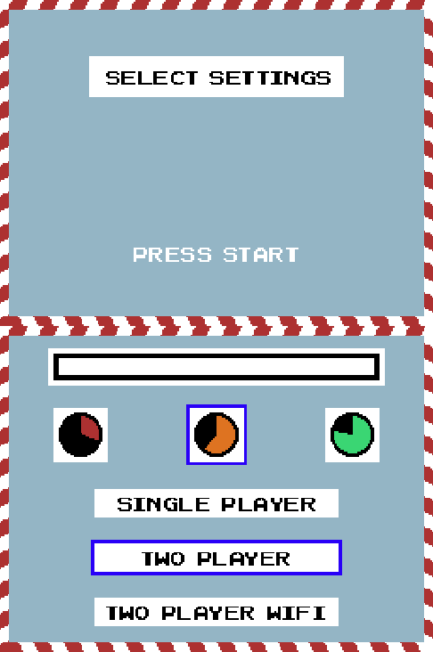
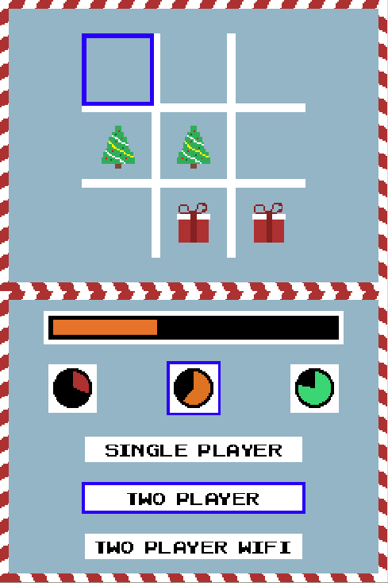
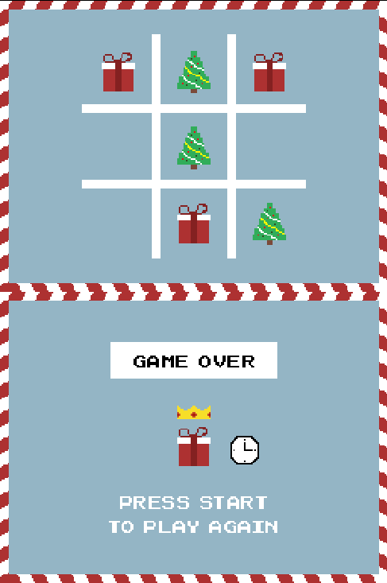
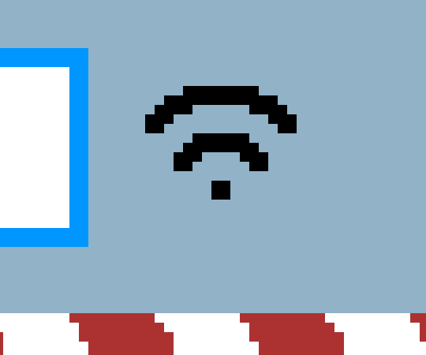
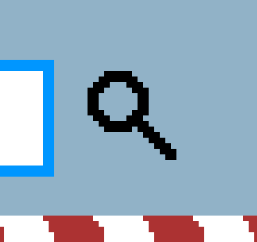
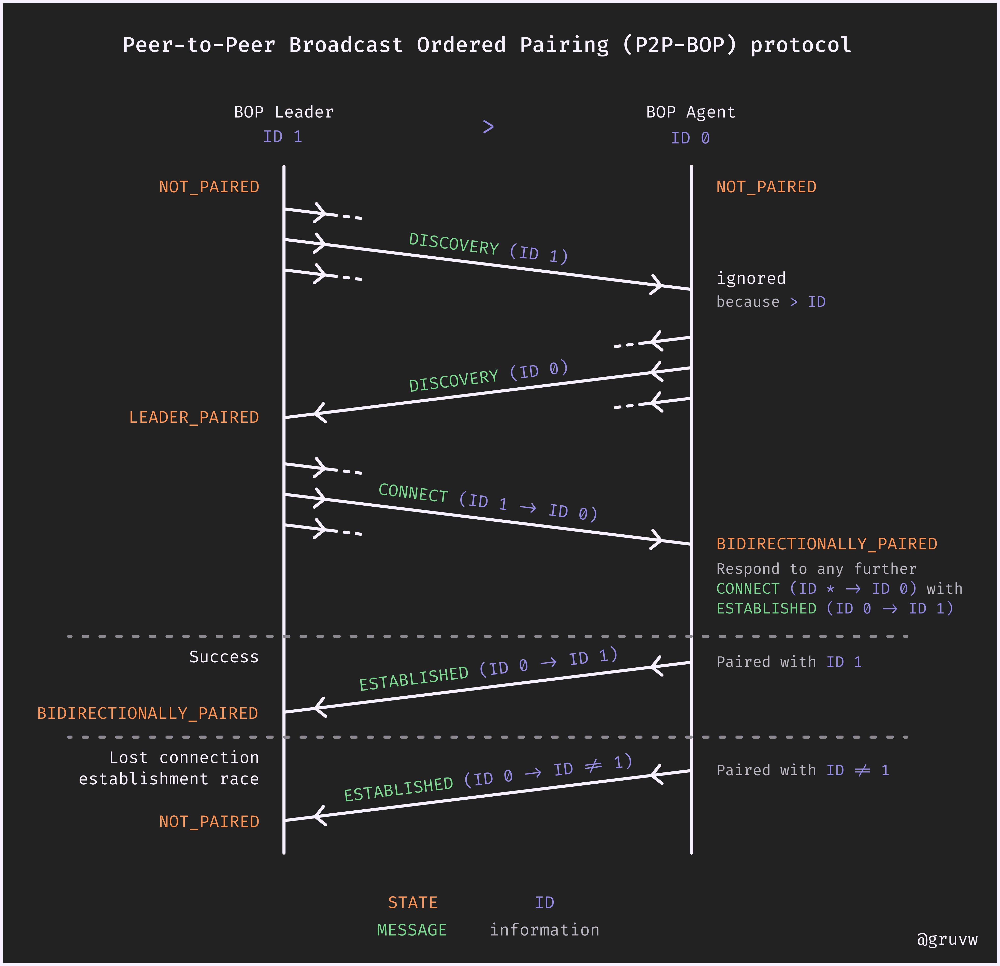
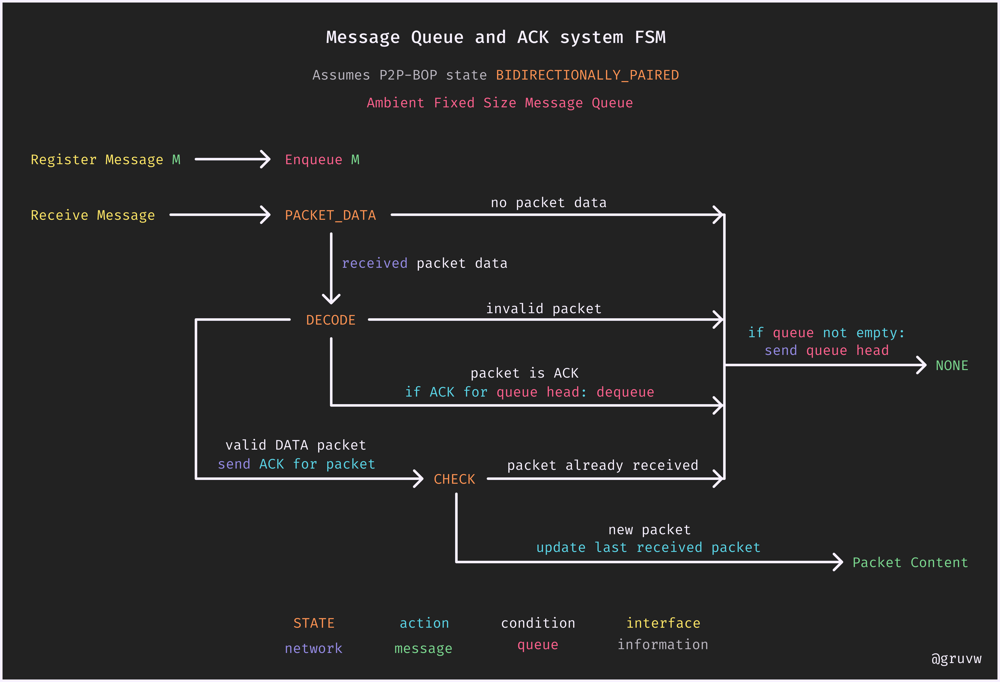

# Tic-Tac-Tile NDS Game Project

This game is a [Tic-Tac-Toe](https://en.wikipedia.org/wiki/Tic-tac-toe) clone on the [NDS](https://en.wikipedia.org/wiki/Nintendo_DS) with multiplayer capabilities, playable through Wi-Fi.

EPFL BA5 EE-310 (embedded systems) NDS project  
Lucas Jung @gruvw (324724)

**Name**: the name Tic-Tac-Tile is a modification of the original Tic-Tac-Toe game name. It is a reference to the word "TacTile", denoting the bottom tactile screen of the NDS. Additionally, the last word "Tile" is a reference to the tile mode of the graphical engines of the NDS. The last layer of meaning behind the name is the sound of a clock "tic tac" as there is some kind of a time pressure aspect to the game.

## Showcase

Here are a few pictures of the Tic-Tac-Tile game:

<div>
  
  <br>
   
   
   
</div>

## Instructions

Instructions to play Tic-Tac-Tile :)

### Installation

To install the game, you will need to obtain the `tic-tac-tile.nds` game file.

Use one of the following method:

- Download it online from the latest GitHub release: [`tic-tac-tile.nds`](https://github.com/gruvw/epfl-nds-game/releases/download/v1.0.0/tic-tac-tile.nds)
- Build it from source: clone this repository and run `make build` in the same directory as this README (requires [`devkitpro-pacman`](https://apt.devkitpro.org/install-devkitpro-pacman)). The game file `tic-tac-tile.nds` will be generated in that directory.

Place the `tic-tac-tile.nds` file inside the micro SD card of an [R4 cartridge](https://en.wikipedia.org/wiki/R4_cartridge).

### Game

Once the game boots up, you'll be welcomed by a nice background music and the settings menu.

#### Settings

It features 3 **game modes**:

* Single player mode, against bot/AI
* Two player mode, single NDS
* Two player mode, two NDS over Wi-Fi

Select among the 3 **speeds** to adjust the game's difficulty:

* Slow (green)
* Medium (orange)
* Fast (red)

#### Play

1. Select the settings that you want by using the bottom touch screen. (see below for [Wi-Fi Two Player Mode Setup](#wi-fi-two-player-mode-setup))
2. Press on the `START` button to launch a game.
    * In Wi-Fi two player mode, the first player to press `START` will go first and starts the game for both players.
3. Select the square where you want to place your piece using the `LEFT`, `RIGHT`, `UP`, `DOWN` arrow buttons.
4. Press on the `A` button to confirm your choice and place your piece. Be carefull about the progress bar, you need to play before you run out of time to win!
5. Wait for the other side to play.
    * In single player mode, the bot will play instantly after your turn.
    * In (local) two player mode, you need to hand out the Nintendo DS to the other player so they can play on the same device.
    * In Wi-Fi two player mode, simply wait for your opponent to play on their Nintendo DS.
6. Carry on till you reach the Game Over screen. Alternatively you can also press the `START` button at any moment to put an end to the current game and go directly to the Game Over screen.
    * If one of the side won, their 3 winning pieces will be highlighted on the board. Additionally, the winning side will be crowned on the bottom screen.
    * A clock will be displayed on the bottom screen in case they won because the other side ran out of time.
    * No information will be displayed on the bottom screen if the game resulted in a draw or if it was interrupted. In that case, you will simply see the Game Over screen and the final state of the board.
7. You can start a new game by pressing the `START` button to go back to the settings selection menu.

Have fun !

#### Wi-Fi Two Player Mode Setup

In order to play in Two Player Mode over Wi-Fi, each player playing on their own NDS, you need to complete the following setup first:

1. Take a smartphone and disable your Wi-Fi and cellular data (as you will create a public Access Point).
2. Go into your phone settings a configure your Access Point (AP) network sharing.
3. Setup the SSID (name of your internet sharing AP) to be `SEM-NDS`.
4. Instead of putting a password, select `None` in the AP configuration security settings to disable password authentification, essentially making a public network.
5. You are good to go :)

NDS setup:

1. Start the game on both NDS.
2. Click on the "Two Player Wi-Fi" game mode. Keep the NDS very close to the AP.
3. You will see the Wi-Fi icon show up while trying to connect to the AP: <p align="center"></p>
    * If the connection is successful, the "Two Player Wi-Fi" mode will now be selected.
    * Otherwise (fails to connect to AP) it will stop trying to connect after a few seconds, hide the Wi-Fi icon and leave you in your current game mode.
4. Once the "Two Player Wi-Fi" mode is selected (successfully connected to AP), the search icon will indicate that your NDS is ready to pair with another NDS: <p align="center"></p>
5. When two NDS are looking to connect together, they will find each other automatically and pair. The paired/success icon will be displayed on the two NDS once the connection is fully established: <p align="center"></p>
6. Each player can chose their own speed difficulty independently. You can now start a game!
7. At the end of the game, each player needs to press the `START` button to go back to the main menu. The search process will start again (back to point 4). It allows to change opponent between games if another NDS is also searching (more than 2 NDS connected on AP). Otherwise just wait a few seconds to connect back to your opponent.

**Note 1**: on the main menu, you can restart the pairing process by pressing the `SELECT` button (e.g. if you want to pair to someone else).

**Note 2**: you can play with more than 2 NDS on the same Wi-Fi network! You can have multiple games running simultaneously (e.g. with 4 NDS).

##### Troubleshoot

You should not expect many issues with the game, as it went through extended testing before release.

However, if you happen to run into an issue, there is a good chance that you will find the solution below:

* **Problem 1** - You are stuck in a game. Simply press the `START` button once to bring up the Game Over screen, and then a second time to get back to the main menu.
* **Problem 2** - Wi-Fi connection is momentary interrupted: this can take the form of longer time in search mode trying to pair to your opponent or a move played during a game that is not reflected on the other NDS during a game. This is normal and can happen, make sure to keep the phone AP very close to the NDS and wait for the messages to arrive.
* **Problem 3** - If one or more NDS is blocked in search mode and cannot find the other NDS to connect to:
    1. First, try to press the `SELECT` button on all affected NDS to reset the connection process and see if it helps.
    2. If that did not work, it means the Wi-Fi connection is permanently lost (see Problem 4 below).
* **Problem 4** - Wi-Fi connection is permanently lost: this can take the form of NDS blocked in search mode (even after pressing the `SELECT` button) or not being able to select the "Two Player Wi-Fi" mode. You can simply shutdown all the NDS and the smartphone Wi-Fi Access Point, and then restart the Wi-Fi setup (full systems reboot). Everything should be working normally after that.

**Note**: there are no security features built into the Tic-Tac-Tile game. Games can be rigged by hackers on the same (public) local network.

## Development

This project was less about creating a great game to play than it was about controlling peripherals and embedded programming.
I chose a simple game but utilized a lot of peripherals and NDS functionalities.
The focus was on **code quality**, writing a good **documentation**, and **Wi-Fi communication reliability**.

### Presentation

#### NDS Features Checklist

ARM Processors:

* ARM9 to control the two screens, the buttons (Left, Right, Up, Down, A, Start, Select), send IPC messages to ARM7 to control sound and Wi-Fi.
* ARM7 for audio, touchscreen and Wi-Fi.

Timers / Interrupts:

* Timer 0: variable speed, game time progress bar.
* Timer 1: FREQ_64(60), game state FSM update.	
* Timer 2: TIMER_FREQ_64(10), button debounce, Wi-Fi spam prevention.

Graphics:

* Main display: Mode 5 with backgrounds 2 and 3 (ext. rotoscale), used to display the game pieces, and the board background + begin menu.
* Sub display: Mode 5 with backgrounds 0 (tiled mode) and 2 (ext. rotoscale), used to display the settings selection + progress bar, and the game over screen.

Keypad:

* Controlling the top game board actions (interrupts):
    * Left, Right, Up, Down = Move selected cell
    * A = Place piece on selected cell
    * Start = Start, Terminate, Restart game
    * Select = Reinitiate NDS pairing (Wi-Fi)

Touchscreen:

* Select the game settings in the game menu, 6 different touch areas used, select game difficulty (speed) and game mode.
* Reading touchscreen by polling.

Sound:

* There is a background music (MOD format) in the menu.
* Another background music (MOD format) is playing during a game. It will speed up depending on the selected game difficulty.
* Playing 3 sound effects (WAV format): when selecting a setting in the menu, when placing a piece on the board, and at the end of the game. 

Sprites:

* 7 sprites in the project: 4 sprites are used to display the outcome of the game on the Game Over screen: (1) crown for the winner, each side (2) has their sprite, (1) clock to indicate losing because of timer; 3 sprites indicate the status of the NDS connection/pairing (Wi-Fi).

Wi-Fi:

* Wi-Fi connection with AP is used to communicate between two NDS and play two player games.
* Designed and implemented P2P-BOP protocol to pair two NDS.
* Designed and implemented Message Queue and ACK system to avoid packet loss.
* Added simultaneous message (START) action recovery mechanism.

#### NDS improvements

* Implemented a bot/AI for single player mode that plays perfectly: using a minimax algorithm to find the best move + hard coded every first move response as it was to slow (~2 seconds) to compute.
* Added button debounce procedure (using a timer) to avoid double trigger of NDS physical buttons.
* Modified WiFi_minilib: implemented Wi-Fi AP connection timeout (do not stuck the game if can’t connect to AP, can still play other game modes even after connection failure).
* If both players press START at the same time (in Wi-Fi mode) it will launch a conflict resolution process and still work as expected.
* Wi-Fi stack implementation stands very strongly against packet loss thanks to the ACK and Message Queue system.

**Note**: see source code for more details!

### Project structure

Here is the project structure:

```
.
├── art
├── audio
├── data
├── docs
└── source
    ├── controller
    │   └── wifi
    ├── model
    └── view
```

* `art` - The folder with the [Aseprite](https://en.wikipedia.org/wiki/Aseprite) pixel "art" files for the game. There are 17 art files done entirely by me. Note that the colors in those files (and in `data`) might not be accurate as they are in fact redefined by the two color palettes in the game.
* `audio` - The music and sound effect files. I did not create those myself, but I found them on sites that reference public and free to use sounds.
* `data` - Arts export to images, later processed by [GRIT](https://www.coranac.com/man/grit/html/grit.htm).
* `docs` - Contains the images used in this README.
* `source` - The source code for the game. Follows a strict [MVC](https://en.wikipedia.org/wiki/Model%E2%80%93view%E2%80%93controller) code architecture.
    * `controller` - Puts together the view and model, and orchestrates the game's logic. It also contains the audio components.
        * `wifi` - Implementation of the fully custom Wi-Fi stack and protocols (P2P-BOP and Message Queue ACK system).
    * `model` - [Bit Field Vector](https://en.wikipedia.org/wiki/Bit_array) modelling of the Tic-Tac-Toe game. It also contains the implementation of the bot/AI used in single player mode.
    * `view` - Contains the screen/graphics components and sprites control.

**Note**: I wrote close to 2000 lines of C code for this project in the `source` folder. This does not account for debugging time, artwork, system design, testing and documentation.

### Wi-Fi Connectivity Stack

In order to ensure reliable communications over an unreliable and broadcast only channel I designed and implemented a new protocol: **Peer-to-Peer Broadcast Ordered Pairing (P2P-BOP) protocol**.

It takes avantage of randomly chosen network IDs ordering to initiate a bidirectional connection between two devices after a discovery process.
It is not tied to NDS and might aswell be used in other broadcast only peer-to-peer environment.

Here is a simplified diagram of how it works:



After a successful bidirectional pairing between two devices we are still left with the packet loss issue. To fix this problem, I implemented a packet acknowledgment (ACK) system along with a message queue.
The device will keep sending their pending message while it was not ACKed by the other (paired) device.

Here is a simplified diagram of how it works:



Additionally the system will first check for the correct unique game identifier and match the sender and receiver IDs of the packet before processing it.
That allows for more than two simultaneous players on the same AP Wi-Fi network.

I also implemented a "simultaneous message action recovery mechanism" to fix the problem of two NDS sending the same message to each other at the same time and being stuck in a dead state.
Essentially the connection leader will keep its state and inform the other NDS to reset their state when it detects a simultaneous message event (conflict resolution process).

**Note**: if you want to further understand the implementation of those mechanisms, check the `source/controller/wifi/packet.c` file.

### Roadmap

- [X] Board model + utilities
- [X] Main background graphics
- [X] Connect board model to view
- [X] Keys handling + cell selection
- [X] Sub background settings graphics
- [X] Settings selection touch
- [X] Begin and game over screens
- [X] Custom palettes generation
- [X] AI (minimax)
- [X] Timer + progress bar
- [X] Game Over sprites
- [X] Improve project structure
- [X] Music + sound effects
- [X] Polish code + add comments
- [X] Fully test game
- [X] Presentation
- [X] Write README
- [X] Wi-Fi packet stack + P2P-BOP design and implementation
- [X] Wi-Fi ACK system
- [X] Wi-Fi two player mode messages processing
- [X] Keys debounce with timer
- [X] Same packet simultaneous sending resolution (start game)
- [X] Clean, comment, and polish code
- [X] Game music speed changes with difficulty
- [X] Fully test game
- [X] Diagrams (Game FSM, P2P-BOP connection, ACK & queue FSM)
- [X] Update presentation
- [X] Go back to 16 bits network identifiers
- [X] README full documentation + code structure + BOP protocol explain
- [X] Last full project review (code, README, presentation, game test)
- [X] GitHub reorganize repo (project and others)
- [X] GitHub release (add link of file to README)
