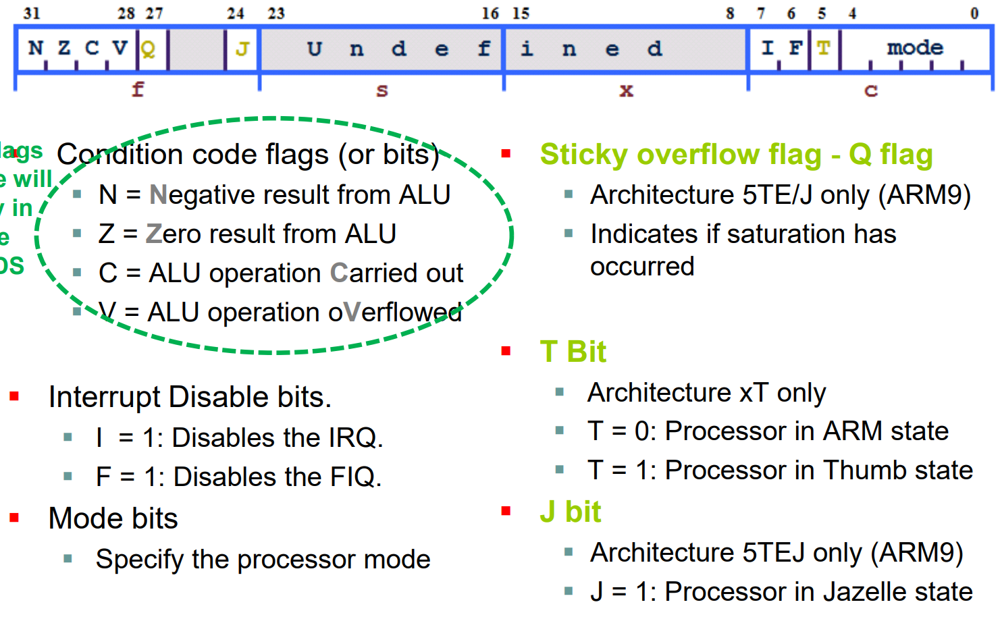
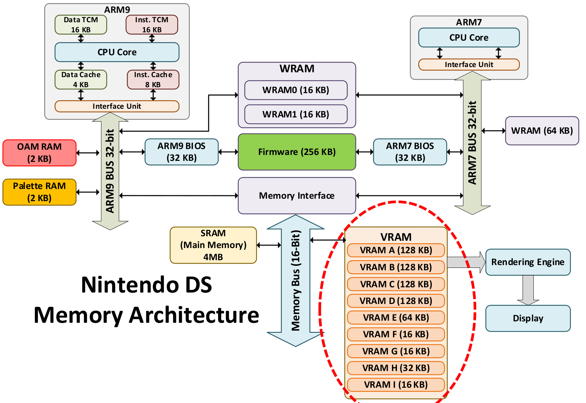
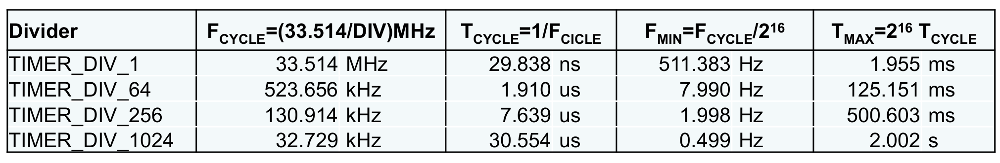
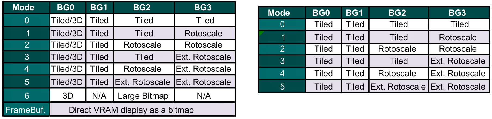
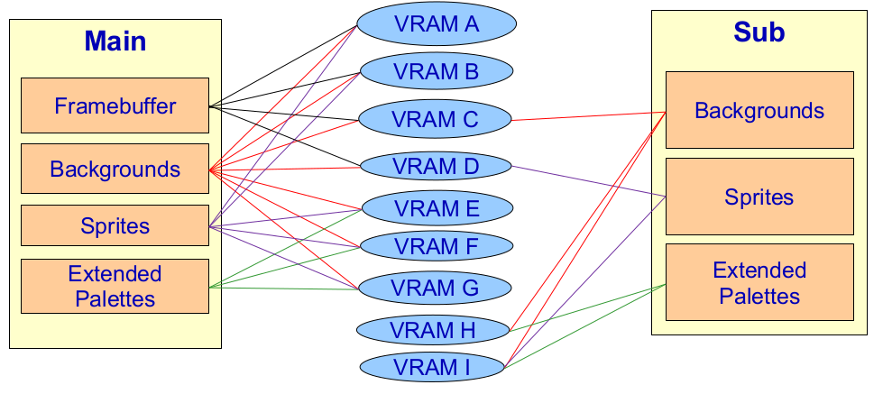
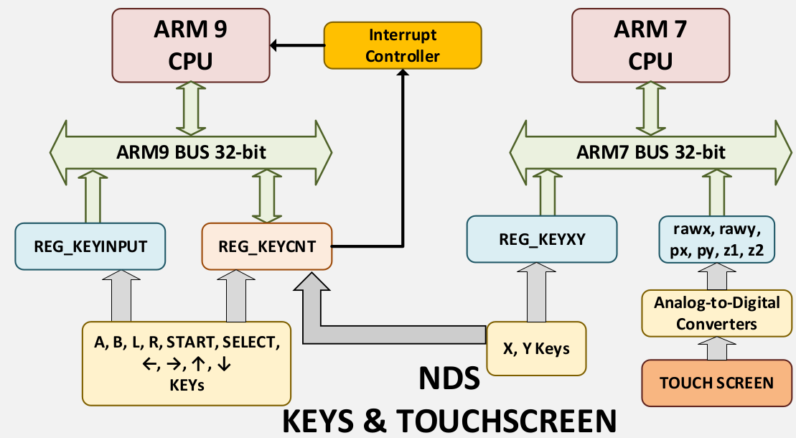

Lucas Jung (@gruvw) - EPFL BA5

# SEM (EE-310) notes

## NDS

### Processor

Two advanced RISC processors:

* ARM9 (66 MHz) - ARM 946E-S
  * Keys: A, B, L, R, arrows, select, start
  * LCD TFT
  * GBA Flash
  * BIOS in ROM: `0xffff0000 ` to `0xffff7fff ` (32KB)
  * Harvard
* ARM7 (33 MHz) - ARM 7TDMI-S
  * Keys: X, Y
  * Touchscreen
  * WiFi
  * Audio
  * Screen open-close
  * BIOS in ROM: `0x00000000` to `0x00003fff` (16KB)
  * Von Neuman
* Communicate via WRAM

ARM processor:

* 32-bit RISC processor (32-bit instruction = word size)
* 37 registers of 32-bits (16 available)
* ALU, multiplier, caches
* Litte endian (by default)
* Up-to 4 function parameters (registers `r0-r3`), rest through stack
* Return value in `r0`
* Interupts (`intr0` less priority < `intr1` more priority)

Program status register `cpsr`:

{ width=50% }

### Memory

Main RAM: 

* From `0x02000000` to `0x023fffff` (4MB)

VRAM:

* From `0x06000000` to `0x068A0000` (656KB)

Cartige ROM:

* From `0x08000000` to `0x09ffffff` (32MB)

NDS memory architecture:

{ width=50% }

### Utilities

Find macro value: `grep -rn "REG_DISPCNT" /opt/devkitpro/libnds/include/nds`

## Peripherals

Interrupts sources:

* Graphic (x2)
* Timer (x4)
* DMA (x4)
* Keypad
* GBA Flashcard
* FIFO
* GFX FIFO
* DS Card
* ...

Interrupts:

* `IRQ_VBLANK`: Vertical blank
* `IRQ_HBLANK`: Horizontal blank
* `IRQ_TIMER0`: Timer 0
* `IRQ_KEYS`: Keypad
* `IRQ_WIFI`: WiFi
* `IRQ_DMA0`: DMA 0

Interrupts handler:

* Initialize interrupts subsystem: `irqInit()`
* Specify handler for interrupt: `irqSet(IRQ_MASK irq, VoidFunctionPointer handler)`
* Remove handler for interrupt: `irqClear(IRQ_MASK irq)` (before disable)
* Allow/Enable given interrupt: `irqEnable(uint32 irq)`
* Prevent/Disable interrupt: `irqDisable(uint32 irq)`

### Timer

Information and formulas:

* Clock is `33.514` MHz
* 4 hardware timers, 16 bits counter
* Maximum measured ticks: `2^16 - 1` ticks
* Maximum measured time: `M = (2^16 - 1) * VALUE / 33514000` seconds
* Find start timer value or frequency for `x` seconds:
  * Frequency: `f = 33514000 / VALUE` Hz
  * Time of a cycle: `t = 1 / f` seconds
  * Maximum time: `M = (2^16 - 1) * t` seconds
  * Number of ticks: `n = x * f` ticks
  * Start timer value: `s = (2^16 - 1) - n`, equivalent to using macro with `freq = 1 / x` Hz

Macros:

* `TIMER_DATA(n)`: de-referenced pointer to data register `n`
* `TIMER_CR(n)`: de-referenced pointer to control register `n`, same as `TIMERn_CR`
* `TIMER_ENABLE`: enable timer
* `TIMER_DIV_VALUE`: timer counts at `(33.514 / VALUE)` MHz (`VALUE`: 1, 64, 256, 1024)
* `TIMER_FREQ_VALUE(freq)`: register value to start counting from so that it overflows each `1/freq` second (user `TIMER_FREQ` for `VALUE` 1)
* `TIMER_IRQ_REQ`: request interrupt on overflow

Examples:

* `TIMER_DATA(0) = TIMER_FREQ_64(125)`
* `TIMER_CR(0) = TIMER_ENABLE | TIMER_DIV_64 | TIMER_IRQ_REQ`
* `irqSet(IRQ_TIMER(0), &ISR_TIMER0)`: set the interrupt handler to the function `ISR_TIMER0` (don't forget to `irqInit()` before), (`IRQ_TIMER(n)` equivalent to `IRQ_TIMERn`)
* `irqEnable(IRQ_TIMER(0))`: enable interrupt

Pre-computed divider boundaries:

{ width=70% }

### Graphics

Information:

* Each pixel is 16 bits RGB
  * 1 bit for transparency: 0 transparent, 1 opaque
  * 5 bits intensity for each color: 0 minimum, 31 maximum
* Macros `ARGB16(...)` and `RGB15(...)`
* Resolution of screen
  * 192 rows (`SCREEN_HEIGHT`)
  * 256 columns (`SCREEN_WIDTH`)
  * 49152 pixels
  * Drawn from left to right and top to bottom
* Interrupts when drawing
  * `IRQ_VBLANK`: vertical blank, once per screen refresh
  * `IRQ_HBLANK`: horizontal blank, once per line refresh
* Bitmaps in VRAM used with ARM9 from `0x06000000` to `0x068A0000` (656KB)
  * `A` to `D`: 128 KiB
  * `E`: 64 KiB
  * `H`: 32 KiB
  * `F`, `G`, `I`: 16 KiB

Configuration sequence:

* Power Manager configuration: `REG_POWERCNT`
  * `POWER_LCD`: LCD screen
  * `POWER_2D_A`: Main 2D core
  * `POWER_MATRIX`: 3D Matrix
  * `POWER_3D_CORE`: Main 3D core
  * `POWER_2D_B`: Sub-display 2D core
  * `POWER_SWAP_LCDS`: Screen used by the main core
* Graphical engines configuration: `REG_DISPCNT` (mode)
  * `MODE_a_2D` where `a` in `0..=6`
  * `ENABLE_3D`
  * `DISPLAY_b_ACTIVE` where `b` in `{BG0,BG1,BG2,BG3,SPR}`
  * `DISPLAY_c_ON` where `c` in `{WIN0,WIN1,SPR_WIN}`
  * 2D mode
  * `MODE_FBd` where `d` in `0..=4`
* VRAM configuration: `VRAM_x_CR` (activate and configure banks)
  * Mode
  * Shifting
  * `VRAM_ENABLE`

Examples:

* `REG_POWERCNT = POWER_LCD | POWER_2D_A`
* `REG_DISPCNT = MODE_0_2D | DISPLAY_BG1_ACTIVE`: activate mode 0 and background 1
* `VRAM_A_CR = VRAM_ENABLE | VRAM_A_LCD`: activate bank A, map it to 2D background representation
* `REG_DISPCNT = MODE_FB0` and `VRAM_A_CR = VRAM_ENABLE | VRAM_A_LCD`: to use `FB0`
* `ARGB16(1, 31, 0, 0)`, `RGB15(31, 0, 0)`
* Pointer to buffer: `u16 * buff = (u16 *) VRAM_A` (pixel is 16 bits, read VRAM pixel by pixel)

Screen modes:

{ width=80% }

VRAMs banks for types of data:

{ width=50% }

#### Framebuffer Mode

* Drawing map of pixels directly
* Four framebuffers associated with their 128 KiB VRAM bank (`FB0` with `VRAM_A`, `FB3` with `VRAM_D`)
* Full screen takes `192*256*16/1024/8 = 96` KiB
* Support for double buffering
  * One buffer is read to be written on the screen
  * The other buffer used to change/write the next image to draw
  * Swap/Exchange during `VBLANK` interrupt
* Enable framebuffer mode for sub display by swap screens: toggle bit 15 `REG_POWERCNT ^= BIT(15)`

Example:

* Fill canvas with white color: `memset(VRAM_A, 0xFF, 256*192*2)`

#### Rotoscale Mode

Additional configuration:

* Configure each active background `BGCTRL[n]` (pixel configuration 8/16 bits), background memory organized in data blocks
  * Set bitmap base address, indicate slot to use in dedicated background memory `BG_BMP_BASE(x)` (increase of 16 KB)
  * Indicate background size and format `BgSize_m_yxz`, `m` is `B8` or `B16` (bitmap pixel size), `yxz` is background size (e.g.: `256x256`)
* Initialize pallets when using 8 bits mode `BG_PALETTE[0..=255]`
* Optional: adjust affine transformation matrix (for each background)

Palettes:

* Collection of 256 colors (in ARGB16), 512 B
* 8 bits per pixel (index in palette)
* Dedicated Palette RAM (2 KiB), faster and consumes less power
* Palette pointer: `uint_16 * myPalette = BG_PALETTE`
* Write to palette: `BG_PALETTE[1] = BLUE`, use `BG_PALETTE_SUB` for sub display
* Two possibilities for palettes
  * 1 palette of 256 colors: 8 bits per pixel (64 B tile size), colors from `0x00` to `0xFF`
  * 16 palettes of 16 colors: 4 bits per pixel (32 B tile size), palette from `0x0` to `0xF`, color from `0x0` to `0xF`
  * Index 0 in palette is used for transparency (displays when no opaque background pixel behind)
* Use `BgSize_B16_256x256` to configure background for emulating framebuffer mode

Software Interrupt mode (SWI):

* Copy data from one point to another 
* `void swiCopy (const void *source, void *dest, int flags)`, uses 2 bytes `u16`
* `source`: origin memory address
* `dest`: destination memory address
* `flags`: data size/length (in 2-byte words) to copy

Affine transformation matrix:

* Rotoscale: rotation and scaling
* Structure `bg_transform` (`xdx`/`hdx`, `ydx`/`vdx`, ..., `dx`, `dy`), fixed-point numbers (8 bits decimal part `Q1.8`, e.g.: `1.00000000 := 256 = 1 << 8`)
* One matrix per background: `bgTransform[background_nb]`
* Must define the transformation matrix (required for Ext. Rotoscale mode)

GRIT:

* Convert images to Assembly code (in data segment of program)
* Declaration of paletes, maps, graphic data
* Also generates header file to link between C and Assembly
* From terminal `grit myImage.png -g -gB16` > `myImage.h`, `myImage.s`
* Put output files in the `data` project folder
* Get bitmap and pallette (8 bits): `grit bottom.png -gb -gB8 -pu8`

Examples:

* Activation: `REG_POWERCNT = POWER_LCD | POWER_2D_A`
* Deactivation: `REG_POWERCNT &= ~(POWER_LCD) & ~(POWER_2D_A)`
* Activate mode 4 and background 2: `REG_DISPCNT = MODE_5_2D | DISPLAY_BG2_ACTIVE`
* Activate mode and background for SUB display: `REG_DISPCNT_SUB = MODE_5_2D | DISPLAY_BG2_ACTIVE`
* Store image of 256x256 pixels with palette (64 KiB), activate VRAM: `VRAM_A_CR = VRAM_ENABLE | VRAM_A_MAIN_BG`
* Main 2D engine, background 2, base address 0, 256x256 image size, one palette format (`B8`): `BGCTRL[2] = BG_BMP_BASE(0) | BgSize_B8_256x256` (or `BGCTRL_SUB[x]`)
* Write color: `BG_BMP_RAM(0)[row * SCREEN_WIDTH + col] = color` (`BG_BMP_RAM(0) === BG_GFX`)
* Transfer image (to base address 0): `swiCopy(imgBitmap, BG_BMP_RAM(0), imgBitmapLen/2)`
* Transfer palette: `swiCopy(imgPal, BG_PALETTE, imgPalLen/2)`

#### Tiled mode

* Useful for repeated pieces of graphics
* Tile size is 8x8 pixels (64 pixels), screen width 32 tiles, screen height 24 tiles, total of 32x24=768 tiles on screen (can have more out of screen, scrolling effect)
  * Tiles map possibilities: 32x32, 32x64, 64x32, 64x64
* Maximum of 1024 tiles (as index map is 10 bits)
* Can be used for background (configure `BGCTRL[x]`)
* Tiles transformations like rotoscale
* Tile is matrix of color indexes in palette
* Tiles stored from base address `BG_TILE_RAM(x)`, `BG_TILE_RAM_SUB(x)`
  * Tile base address must be multiple of 16 KB (0x4000)
  * Maximum size is 256 KB
* Configure background control register: `BG_TILE_BASE(x)` (16 values of base address, `x` in `0..=15`, 4 bits for `TILE_BASE` in `REG_BGnCNT`)
* Screen size is 256 pixels (32 tiles) by 192 pixels (24 tiles)

Tile referencing (map format):

* Each tile is referenced with 16 bits
  * Tile number: 10 bits
  * Horizontal/Vertical mirror: 2 bits
    * Horizontal flip: `tile | BIT(10)`
    * Vertical flip: `tile | BIT(11)`
  * Palette used (if 16-color palette): 4 bits (16 possible palettes), bits 15-12 specify palette number
* Map can start (map base) in address multiple of 2 KB (0x800)
  * Most used BG: 32x32 tiles (2 B per tile), total of 2 KB
  * Config BG register controller: `BG_MAP_BASE(x)` (increase of 2KB for tile mode, 16 KB for rotoscale), `BG_TILE_BASE(x)` (increase of 16KB)
  * Write the tile definition: `BG_TILE_RAM(x)`, `BG_TILE_RAM_SUB(x)`
  * Access tile to set/modify: write layout with tiles `BG_MAP_RAM(x)[row*32 + col]`, `BG_MAP_RAM_SUB(x)` (or tile number with flip bits)

Configuration `BGCTRL[n]` / `BGCTRL_SUB[n]` (same as `REG_BGnCNT`):

* Number of tiles in tiles map
* Number of colors in palette
* Memory positions for map and for tiles (base address)

Direct Memory Address:

* Faster for large amount of memory (larger than a tile)
* Perform data transfers without CPU intervention (DMA controller)
* CPU configures DMA controller to make data transfer between peripherals
  * Base address, Destination address, Data size
* DMA controller performs I/O operation autonomously when bus available
* `void dmaCopy(const void * source, void * dest, uint32 size)`, uses 1 byte `u8`
* Always cast `dest`: `(u8*)`
* Used to copy the tiles to e.g. for second tile: `&BG_TILE_RAM(0)[32]` (size 64)

GRIT:

* Option to generate tiles `-gt`
* Option to generate palette `-p`
* Image to transform should have size multiple of 8
* Map can be generated if full image is going to be displayed (tiled mode): option `-m`

Examples:

* Configure engine: `REG_DISPCNT = MODE_0_2D | DISPLAY_BG0_ACTIVE`
* Configure VRAM bank: `VRAM_A_CR = VRAM_ENABLE | VRAM_A_MAIN_BG`, use `VRAM_x_SUB_BG` for sub (look which VRAM available in picture)
* Background 0 in SUB display, 32x32 tiles, use 1 palette (256 colors), in `MAP_BASE0`, tiles at 2 KB from `TILE_BASE`: `BGCTRL_SUB[0] = BG_32x32 | BG_COLOR_256 | BG_MAP_BASE(0) | BG_TILE_BASE(1)` (be careful for overlap between `MAP_BASE` and `TILE_BASE`)
* Used tiled mode and ext. rotoscale in one: `REG_DISPCNT = MODE_5_2D | DISPLAY_BG1_ACTIVE | DISPLAY_BG3_ACTIVE`
* Copy two custom tiles (`u8 tile[64] = ...`): `swiCopy(tile1, BG_TILE_RAM_SUB(x), 32); swiCopy(tile2, &BG_TILE_RAM_SUB(x)[32], 32);`

### Keys & Touchscreen

Information:

* Events detected in 16 bits register `REG_KEYCNT`
* Pressed keys in `REG_KEYINPUT` (zero bit means key pressed)
* No buffering
* 60 points read/sec with `swiForVBlank()` (interpolate for lines)
* Two arm processors
  * ARM 946E-S: `KEY_A`, `KEY_B`, `KEY_SELECT`, `KEY_START`, `KEY_RIGHT`, `KEY_LEFT`, `KEY_UP`, `KEY_DOWN`, `KEY_R`, `KEY_L`
  * ARM 7TDMI-S: `KEY_X`, `KEY_Y`, `KEY_TOUCH` (for touchscreen), `KEY_LID`
  * Can check bits against macro: e.g. `uint32 keys = keysDown()`, `keys == KEY_x` (strictly only one key), `keys & KEY_x != 0` (maybe multiple keys)
  * Bit 14/15 used to configure interrupts
* Polling (active waiting using infinite loop) in libnds
  * Polling is slower and consumes more power than interrupts
  * Call `swiWaitForVBlank()` inside of polling loop
  * Scans and stores pressed keys and touchscreen: `void scanKeys()`
  * Returns keys pressed/held: `uint32 keysHeld()`
  * Returns only keys pressed: `uint32 keysDown()`
  * Returns only keys released: `uint32 keysUp()`
  * Position where touchscreen pressed: `void touchRead(touchPosition * pos)` (output argument)
    * Check if touchscreen was touched: `keys & KEY_TOUCH`
    * Use API with struct return: `touchPosition pos; touchRead(&pos);`
    * Fields `px` and `py`, touched pixel coordinates
    * `(0, 0)` when screen is not touched, detect touch using `touch.px || touch.py`
    * Position in memory for pixel is `VRAM_x[touch.py * 256 + touch.px]`

Interrupts:

* Set `REG_KEYCNT` to trigger interrupts
* One key triggers an interrupt: set bit 14 (enable interrupts)
* A combination of keys pressed together trigers an interrupt: set bit 15 and 14 + all the keys to trigger interrupt
* Cannot use libnds API in the ISR: use the `REG_KEYINPUT` to identify pressed key with inverse logic `~REG_KEYINPUT & KEY_x != 0`

Examples:

* Key A, Left or Start trigger an interrupt when any is pressed: `REG_KEYCNT = BIT(14) | KEY_A | KEY_LEFT | KEY_START`
* Key A and B trigger an interrupt only when both pressed together: `REG_KEYCNT = BIT(14) | BIT(15) | KEY_A | KEY_B`

Two processors manage keys and touchscreen together:

{ width=50% }

### Sound

Registers:

* Power up sound I/O subsystem: `powerON(POWER_SOUND)`
* Global configuration register `SOUND_CR`
  * Enable and set volume: `SOUND_CR = SOUND_ENABLE | SOUND_VOL(0x7F)`
  * 127 possible volumes from silent `0x00` to full `0x7f`
* Each channel configured independently (16 channels audio)
  * Channel activation: `SCHANNEL_CR(index)`
  * Configuring channel 0: `SCHANNEL_CR(0) = SCHANNEL_ENABLE | SOUND_ONE_SHOT | SOUND_8BIT`
  * Must configure (at least) three properties with `SCHANNEL_property(index)`
    * Playback frequency `SCHANNEL_TIMER(0) = SOUND_FREQ(11127)`
    * Pointer to sound to play `SCHANNEL_SOURCE(0) = (uint32) sound1`
    * Duration (32 bits): `SCHANNEL_LENGTH(0) = ((int) sound1_end - (int) sound) >> 2`

MaxMod:

* Module files: background music (`.mod`, `.s3m`, `.it`, `.xm`)
* Sound effects: play on demand (`.wav` + module formats witohut looping)
* Initialize library pointers to sounds + internal buffers
  * `void mmInitDefaultMem(mm_addr soundbank)`
  * `soundbank` parameter is name of sound-bank binary (default `soundbank_bin`)
  * Not too big (below 2 MB)
* Load music modules
  * `void mmLoad(mm_word module_ID)`
  * `module_ID` parameter is 32 bits index with module identifier
  * All identifiers defined in `soundbank.h`
* Load sound effect
  * `void mmLoadEffect( mm_word sample_ID )`
  * `sample_ID` parameter is 32 bit sample index with effect identifier
* Play music
  * `void mmStart(mm_word module_ID, mm_pmode mode)`
  * `mode` parameter specifies loop or not `MM_PLAY_LOOP` or `MM_PLAY_ONCE`
* Control music using active module identifier
  * `void mmPause()`
  * `void mmResume()`
  * `void mmStop()`
* Play sound effect
  * `mm_sfxhand mmEffect(mm_word sample_ID)`
  * Effect will play without modifying the sound configuration
* Play sound effect with specific sound configuration
  * `mm_sfxhand mmEffectEx(mm_sound_effect* sound)`
  * `sound` parameter is struct with `volume`, `panning`, `rate` (frequency)

Transformation utility:

* Start with raw audio data (uncompressed binary files)
* Use the MaxMod `mmutil` toolchain
* Use `-d` parameter for NDS
* Generates the `soundbank.bin` and header file `soundbank.h`
* Place the audio file sin folder `audio` inside C project

Automatic transformation:

* Place audio files in folder `audio` inside C project
* When building the project files will be generated in the `build` folder (`.bin`, `.h`)
* Use sounds in C project with MaxMod API: include library and soundbank headers

Examples:

* Transform `s1.wav` and `s2.mod`: `mmutil s1.wav s2.mod –d –osoundbank.bin –hsoundbank.h` 

## Acronyms

* NDS: Nintendo DS
* GBA: Game Boy Advance
* LCD: Liquid Crystal Display
* TFT: Thin-Film Transistor
* ARM: Advanced RISC Machine
* RISC: Reduced Instruction Set Computer
* CISC: Complex Instruction Set Computer
* CPU: Central Processing Unit
* ALU: Arithmetic Logic Unit
* CU: Control Unit
* PC: Program Counter
* CR: Control Register
* SR: State Register
* IR: Instruction Register
* MAR: Memory Address Register
* MDR: Memory Data Register
* I/O: Input/Output
* MM: Main Memory
* CM: Cache Memory
* SPM: Scratch-Pad Memory
* RAM: Random Access Memory
* VRAM: Video Random Access Memory
* WRAM: Window Random Access Memory
* REQ: REQuest
* FIQ: Fast Interrupt Request
* IRQ: Interrupt ReQuest
* FREQ: FREQuency
* SVC: SuperVisor Call
* INTR: INTeRrupt
* DMA: Direct Memory Access
* SPI: Serial Peripheral Interface
* ASCII: American Standard Code for Information Interchange
* GFX: Graphics
* FIFO: First-In, First-Out
* API: Application Programming Interface
* RGB: Red Green Blue
* ARGB: Alpha Red Green Blue
* BG: BackGround
* FB: FrameBuffer
* BMP: BitMap Pointer
* SWI: SoftWare Interrupt
* GRIT: GBA Raster Image Transmogrifier
* CNT/CTRL: CoNTRoLler
* A2D: Analog TO Digital
* ISR: Interrupt Service Routine
* IPC: Inter-Processor Communication
