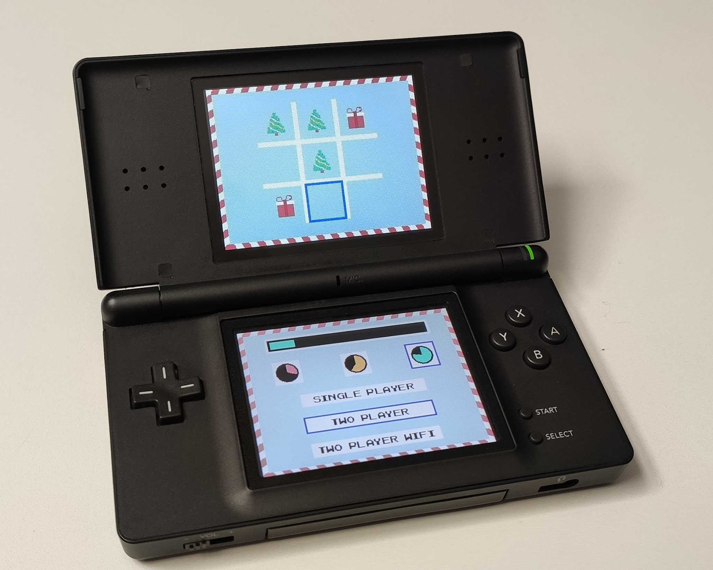
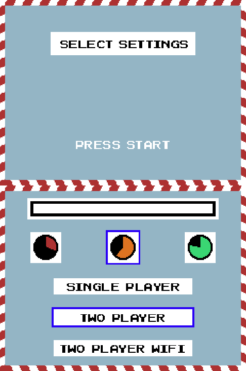
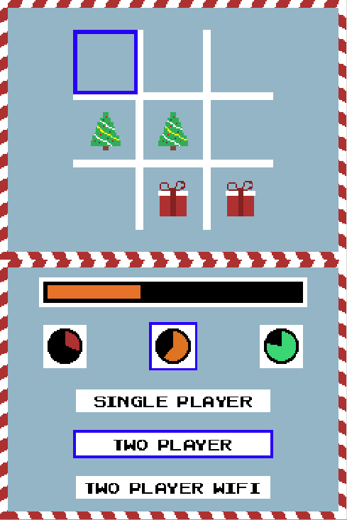
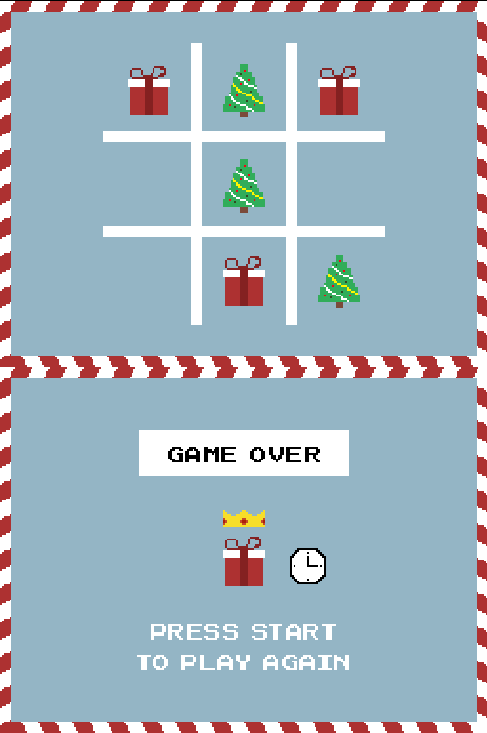
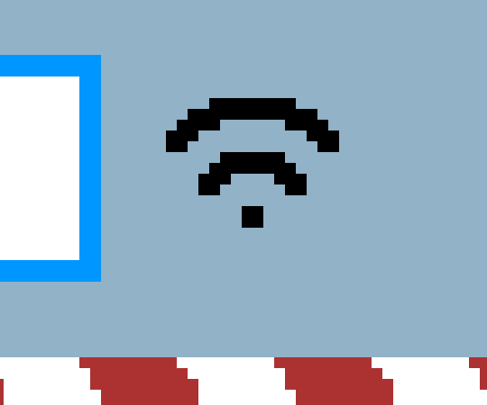
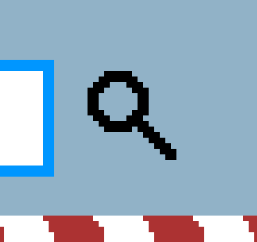
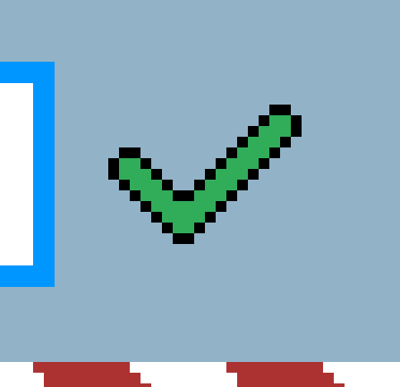

# Tic-Tac-Tile NDS Game Project

EPFL BA5 EE-310 NDS project  
Lucas Jung (324724)

This game is a [Tic-Tac-Toe](https://en.wikipedia.org/wiki/Tic-tac-toe) clone on the [NDS](https://en.wikipedia.org/wiki/Nintendo_DS).

**Name**: the name Tic-Tac-Tile is a modification of the original Tic-Tac-Toe game name.
It is a reference to the word "TacTile", denoting the bottom tactile screen of the NDS.
Additionally, the last word "Tile" is a reference to the tile mode of the graphical engines of the NDS.
The last layer of meaning behind the name is the sound of a clock "tic tac" as there is some kind of a time pressure aspect to the game.

## Showcase

Here are a few pictures of the Tic-Tac-Tile game:

  
   
   
   
   

## Instructions

Instructions to play Tic-Tac-Tile :)

### Installation

To install the game, you will need to obtain the `tic-tac-tile.nds` game file.

Use one of the following method:

- Download it online from the GitHub releases: [`tic-tac-tile.nds`](https://) <!-- TODO -->
- Build it from source by running `make build` in the same directory as this README (requires [`devkitpro-pacman`](https://apt.devkitpro.org/install-devkitpro-pacman)).

Place the `tic-tac-tile.nds` file inside the micro SD card of an [R4 cartridge](https://en.wikipedia.org/wiki/R4_cartridge).

### Game

Once the game boots up, you'll be welcomed by a nice background music and the settings menu.

#### Settings

It features 3 **game modes**:

* Single player mode, against bot/AI
* Two player mode, single NDS
* Two player mode, two NDS over Wi-Fi

Select among the 3 **speeds** and adjust the game's difficulty:

* Slow (green)
* Medium (orange)
* Fast (red)

#### Play

1. Select the settings that you want by using the bottom touch screen. (see below for Wi-Fi two player mode setup)
2. Press on the `start` button to launch a game.
    * In Wi-Fi two player mode, the first player to press start will start the game for both players and will play first.
3. Select the square where you want to place your piece using the `left`, `right`, `up`, `down` arrow buttons.
4. Press on the `A` button to confirm your choice and place your piece.
   Be carefull about the progress bar, you need to play before you run out of time to win!
5. Wait for the other side to play.
    * In single player mode, the bot will play instantly after your turn.
    * In (local) two player mode, you need to hand out the Nintendo DS to the other player so they can play.
    * In Wi-Fi two player mode, simply wait for your opponent to play on their Nintendo DS.
6. Carry on till you reach the Game Over screen.
   Alternatively you can also press the `start` button at any moment to put an end to the current game and go directly to the Game Over screen.
    * If one of the side won, their 3 winning pieces will be highlighted on the board.
      Additionally, the winning side will be crowned on the bottom screen.
    * A clock will be displayed on the bottom screen in case they won because the other side ran out of time.
    * No information will be displayed on the bottom screen if the game resulted in a draw or if it was interrupted.
      In that case, you will simply see the Game Over screen and the final state of the board.
7. You can start a new game by pressing the `start` button to go back to the settings selection menu.

Have fun !

#### Wi-Fi Two Player Mode Setup

In order to play in Two Player Mode over Wi-Fi, each player playing on their own NDS, you need to complete the following setup first:

* Take a smartphone and disable your Wi-Fi and cellular data (as you will create a public Access Point).
* Go into your phone settings a configure your Access Point (AP) network sharing.
* Setup the SSID (name of your internet sharing AP) to be `SEM-NDS`.
* Instead of putting a password, select `None` in the AP configuration security settings to disable password authentification, essentially making a public network.
* You are good to go :)

NDS setup:

1. Start the game on both NDS.
2. Click on the "Two Player Wi-Fi" game mode.
   Keep the NDS very close to the AP.
3. You will see the Wi-Fi icon show up while trying to connect to the AP: 
    * If the connection is successful, the "Two Player Wi-Fi" mode will now be selected.
    * Otherwise it will stop trying to connect after a few seconds, hide the Wi-Fi icon and stay in your current game mode.
4. Once the "Two Player Wi-Fi" mode is selected (successfully connected to AP), the search icon will indicate that your NDS is ready to pair with another NDS: 
5. After two NDS are searching to connect at the same time, they will find each other automatically and pair.
   The paired/success icon will be displayed on the two NDS once the connection is fully established: 
6. Each player can chose their own speed difficulty independently.
   You can now start a game!
7. At the end of the game, when you go back to the main menu, the search process will start again (back to point 4).
   It allows to change opponents between games if other NDS are also searching (more than 2 NDS), otherwise just wait a few seconds to connect back to your opponent.

**Note 1**: on the main menu, you can restart the pairing process by pressing the `select` button (e.g. if you want to pair to someone else).

**Note 2**: you can play with more than 2 NDS on the same Wi-Fi network! You can have multiple games running simultaneously (e.g. with 4 NDS).

##### Troubleshoot

if wifi connection is momentarly lost (a bit long to connect to opponent in search mode, your move does not arrive instantly) it is normal, stay close to AP, messages can take time to complete (it is not stuck, just wait for it to arrive)
if you are blocked in search mode you can press the SELECT button to reset the connection process to see if it helps, otherwise it probably means (bellow)
if wifi connection is permanatly lost (blocked in search mode or can't go into two player mode) there is currently no way to reset it so you need to reboot all NDS and restart AP 
if you are stuck in a game or you have any trouble, just press START to show the game over screen and press start again to lead you to the menu where you can start fresh

Note no security features are built in, wifi games can be rigged by hackers on same (public) local network 

## Development

project less about the actual game but more about the hardware and controlling peripherals, choose a simple game but utilized a lot of peripherals and focused on wifi communication reliability, code quality and documentation

implemented a bot/AI using a minimax recursive algorithm to find the best move + cached first move as too slow
implemented a wifi AP connection timeout (do not stuck the game if can't connect to AP, timeout and can still play in other modes)
in order to ensure reliable communications over an unreliable and broadcast only channel I designed and implemented a new protocol
P2P-BOP protocol
ACK message system for packet loss (decoding packet data), full packet system checks for game_id receiver and sender
receiver and sender + pairing business, allows for more than two players on same AP wifi
show diagrams + for more details jump into the code
Press start at same time will launch a conflict resolution process... (see slides)
debounce button implementation (avoid multiple fast key presses with timer)
WIFI system stands very strong against packet loss with packet queue and ack system
modified provided wifi minilib (cleaned code, added timeout)

### Presentation

project presentation to README

### Code structure

art folder has 17 art/image files (done entirely by me)
MVC architecture
about 1900 lines of code in source

### Roadmap

- [X] Board model + utilities
- [X] Main background graphics
- [X] Connect board model to view
- [X] Keys handling + cell selection
- [X] Sub background settings graphics
- [X] Settings selection touch
- [X] Begin and game over screens
- [X] Custom palettes generation
- [X] AI (minimax)
- [X] Timer + progress bar
- [X] Game Over sprites
- [X] Improve project structure
- [X] Music + sound effects
- [X] Polish code + add comments
- [X] Fully test game
- [X] Presentation
- [X] Write README
- [X] Wi-Fi packet stack + P2P-BOP design and implementation
- [X] Wi-Fi ACK system
- [X] Wi-Fi two player mode messages processing
- [X] Keys debounce with timer
- [X] Same packet simultaneous sending resolution (start game)
- [X] Clean, comment, and polish code
- [X] Game music speed changes with difficulty
- [X] Fully test game
- [X] Diagrams (Game FSM, P2P-BOP connection, ACK & queue FSM)
- [X] Update presentation
- [X] Go back to 16 bits network identifiers
- [ ] README code structure + BOP protocol explain
- [ ] GitHub release (add to README)
- [ ] GitHub reorganize repo (project and others)
